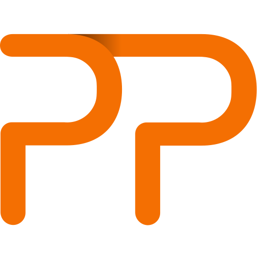
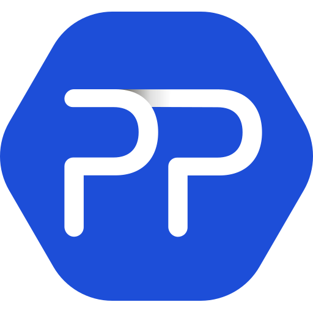
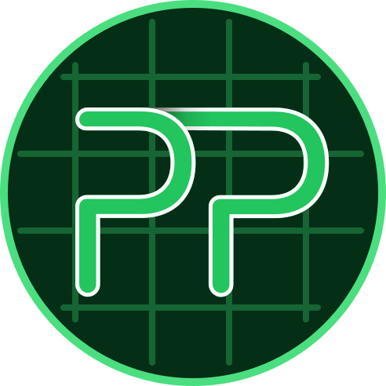
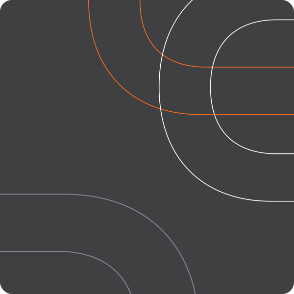

<picture>
  <source media="(prefers-color-scheme: dark)" srcset="logo/logo-supporte-fundo-escuro.svg">
  
</picture>

# Marca Supporte

Este é o repositório oficial da identidade visual da **Supporte**.

Aqui você encontra logotipos, símbolo, favicons, grafismos, fontes, tokens de design e as orientações necessárias para aplicar a marca em materiais, interfaces e projetos de código.

> Use sempre os arquivos originais deste repositório. Não redesenhe, recorte, recolora ou reconstrua a marca.

## Por onde começar

| O que você precisa fazer | Comece por |
| --- | --- |
| Baixar o logotipo | Consulte a seção [Logotipo](#logotipo) |
| Criar uma interface | Use os [tokens de design](#tokens-de-design), as [fontes](#tipografia) e o [DESIGN.md](DESIGN.md) |
| Orientar um agente de IA | Peça para ele ler o [AGENTS.md](AGENTS.md) antes de começar |
| Entender a identidade da Supporte | Consulte o manual de marca interno (não faz parte deste repositório público) |

## Logotipo

Escolha a versão de acordo com o fundo e o tipo de aplicação.

| Versão | Quando usar | Arquivos |
| --- | --- | --- |
|  | Fundos claros ou brancos | [svg](logo/logo-supporte-fundo-claro.svg) · [png](logo/logo-supporte-fundo-claro.png) |
|  | Fundos escuros, como chumbo, preto ou fotografias escuras | [svg](logo/logo-supporte-fundo-escuro.svg) · [png](logo/logo-supporte-fundo-escuro.png) |
|  | Aplicações em uma cor sobre fundo claro | [svg](logo/logo-monocromatica-preta.svg) · [png](logo/logo-monocromatica-preta.png) |
|  | Aplicações em uma cor sobre fundo escuro | [svg](logo/logo-monocromatica-branca.svg) · [png](logo/logo-monocromatica-branca.png) |

### Cuidados importantes

- Use o logotipo com pelo menos **100 px** de largura no digital ou **1,2 cm** no impresso.
- Dê preferência às versões principais para fundo claro ou escuro.
- Use as versões monocromáticas quando a aplicação permitir apenas uma cor.
- Não altere cores, proporções, tipografia ou espaçamento.
- Não rotacione, distorça ou aplique sombras, contornos, degradês e outros efeitos.
- Mantenha uma área livre de 5x ao redor do logotipo. O valor de x corresponde à largura da base do “P”.

### Símbolo PP


O símbolo PP é uma versão simplificada da marca.

Ele pode ser usado em avatares, ícones de aplicativos, crachás e pequenos detalhes de cabeçalhos ou rodapés.

Arquivos disponíveis: [svg](simbolo/pp.svg) · [png](simbolo/pp.png)

O símbolo não substitui o logotipo completo em peças institucionais ou comerciais.

## Favicons

### Sites e ferramentas menores

Em aplicações que não precisam diferenciar ambientes, escolha uma das versões abaixo.

| Visual | Arquivo | Característica | Formatos |
| --- | --- | --- | --- |
|  | `favicon` | Símbolo PP sem fundo | [svg](favicon/favicon.svg) · [png](favicon/favicon.png) · [ico](favicon/favicon.ico) |
|  | `favicon-alt` | Squircle laranja | [svg](favicon/favicon-alt.svg) · [png](favicon/favicon-alt.png) · [ico](favicon/favicon-alt.ico) |
|  | `favicon-producao` | Squircle chumbo | [svg](favicon/favicon-producao.svg) · [png](favicon/favicon-producao.png) · [ico](favicon/favicon-producao.ico) |

### Aplicações com vários ambientes

Em sistemas com desenvolvimento e sustentação ativos, use um favicon diferente para cada ambiente.

As diferenças de cor e formato ajudam a identificar rapidamente se a aba aberta é de produção, homologação ou desenvolvimento local.

| Ambiente | Visual | Arquivo | Formatos |
| --- | --- | --- | --- |
| Produção |  | `favicon-producao` | [svg](favicon/favicon-producao.svg) · [png](favicon/favicon-producao.png) · [ico](favicon/favicon-producao.ico) |
| Homologação |  | `favicon-homolog` | [svg](favicon/favicon-homolog.svg) · [png](favicon/favicon-homolog.png) · [ico](favicon/favicon-homolog.ico) |
| Localhost |  | `favicon-localhost` | [svg](favicon/favicon-localhost.svg) · [png](favicon/favicon-localhost.png) · [ico](favicon/favicon-localhost.ico) |

## Grafismos

Os grafismos da pasta [grafismos/](grafismos/) foram criados a partir das curvas do “P” da marca.

Cada arquivo possui uma variante para fundo claro ou escuro e já indica no nome o canto em que deve ser aplicado. Use o arquivo na posição prevista, sem rotacionar ou reconstruir as curvas.

<table>
<tr>
<td width="33%"></td>
<td width="33%"></td>
<td width="33%"></td>
</tr>
<tr>
<td valign="top">
<strong><code>detalhe-1</code></strong><br><br>
Usado em capas, telas de abertura e slides de título. Os arquivos do canto superior direito e do canto inferior esquerdo devem ser usados juntos. Em apresentações, reserve esse grafismo para a capa e os títulos de seção.
</td>
<td valign="top">
<strong><code>detalhe-2</code></strong><br><br>
Faixa para títulos de páginas secundárias. Quando utilizado, o texto deve aparecer em branco dentro da área laranja.
</td>
<td valign="top">
<strong><code>detalhe-3</code></strong><br><br>
Marca d'água discreta para fundos claros ou escuros. Pode ser usada sozinha ou em conjunto com o <code>detalhe-2</code>.
</td>
</tr>
</table>

Não crie novos padrões ou grafismos a partir do símbolo. Use os arquivos que já estão disponíveis no repositório.

## Cores

A identidade principal da Supporte utiliza três cores.

| Cor | HEX | RGB | Uso |
| --- | --- | --- | --- |
| Chumbo Supporte | `#58595B` | `88, 89, 91` | Textos, fundos e estrutura |
| Laranja Supporte | `#F37021` | `243, 112, 33` | Destaques, chamadas e direção do olhar |
| Branco | `#FFFFFF` | `255, 255, 255` | Fundos e áreas de respiro |

Use chumbo e branco como base da composição. Reserve o laranja para elementos que precisam chamar atenção.

Em produtos digitais, valide o contraste seguindo as recomendações da WCAG. O laranja sobre branco não oferece contraste suficiente para textos pequenos.

## Tipografia

| Família | Uso |
| --- | --- |
| **Titillium Web** | Títulos, chamadas e números de destaque. Use SemiBold nos títulos principais e Regular ou Light nos subtítulos. |
| **Fira Sans** | Parágrafos, interfaces, tabelas e formulários. Use SemiBold em rótulos e destaques. |
| **Fira Code** | Código, comandos, logs e dados monoespaçados. Mantenha as ligaduras ativadas. |

Não use Fira Code em títulos ou textos corridos.

As famílias estão disponíveis na pasta [fontes/](fontes/):

- `ttf` para instalação no computador
- `woff2` para aplicações web
- [fontes.css](fontes/fontes.css) com as declarações `@font-face` prontas

Para usar as fontes em um projeto web:

```html
<link rel="stylesheet" href="fontes/fontes.css">
```

Evite pesos muito leves em tamanhos pequenos, fundos complexos ou situações de baixa resolução.

## Tokens de design

A pasta [tokens/](tokens/) reúne cores, fontes, espaçamentos, raios e outros valores usados em interfaces.

| Arquivo | Uso |
| --- | --- |
| [supporte.css](tokens/supporte.css) | Variáveis CSS prontas para projetos web |
| [supporte.json](tokens/supporte.json) | Tokens no formato W3C Design Tokens |
| [tailwind.preset.js](tokens/tailwind.preset.js) | Preset para Tailwind CSS v3, com orientações para Tailwind CSS v4 |

Exemplo com CSS:

```css
@import url("tokens/supporte.css");

.botao-primario {
  background: var(--supporte-laranja);
  color: var(--supporte-branco);
  border-radius: var(--supporte-raio-md);
  font-family: var(--supporte-fonte-texto);
}
```

Para orientações mais completas sobre interfaces, componentes, contraste e hierarquia visual, consulte o [DESIGN.md](DESIGN.md).

## Uso com agentes de IA

Antes de pedir que um agente crie uma tela, apresentação, documento ou outro material da Supporte, envie o link deste repositório e peça para ele consultar:

1. [README.md](README.md)
2. [AGENTS.md](AGENTS.md)
3. [DESIGN.md](DESIGN.md), quando o trabalho envolver interfaces

O `AGENTS.md` explica como usar logotipos, favicons, grafismos, fontes e outros ativos. O `DESIGN.md` reúne os tokens e as orientações específicas para produtos digitais.

O arquivo `CLAUDE.md` deste repositório aponta para o `AGENTS.md`, permitindo que o Claude Code encontre as mesmas instruções.

Exemplo de pedido:

```text
Crie uma interface usando a identidade visual da Supporte.

Antes de começar, leia o README.md, o AGENTS.md e o DESIGN.md de:
https://github.com/supportelogistica/brand

Use somente os arquivos oficiais do repositório e siga as regras de logotipo, cores, tipografia, grafismos e iconografia.
```

As mesmas regras se aplicam a trabalhos feitos por pessoas ou agentes:

- Não use emojis.
- Use ícones da família [Lucide](https://lucide.dev/).
- Para logos de terceiros, procure no [Iconify](https://icon-sets.iconify.design/) ou no [Icônes](https://icones.js.org/), priorizando coleções como [Simple Icons](https://simpleicons.org/).
- Não redesenhe ativos existentes.
- Use o laranja como destaque.
- Valide o contraste em materiais digitais.

## Estrutura do repositório

```text
brand/
├── AGENTS.md          regras para agentes de IA
├── CLAUDE.md          direcionamento para o AGENTS.md
├── DESIGN.md          tokens e orientações para interfaces
├── LICENCA.md         licença de uso da marca em português
├── LICENSE.md         licença de uso da marca em inglês
├── docs/              imagens e materiais de apoio
├── favicon/           favicons comuns e versões por ambiente
├── fontes/            Titillium Web, Fira Sans, Fira Code e fontes.css
├── grafismos/         grafismos oficiais derivados do P
├── logo/              logotipo em quatro versões
├── simbolo/           símbolo PP isolado
└── tokens/            tokens CSS, JSON e Tailwind CSS
```

O manual de marca completo (voz, tom, públicos, valores) é um documento interno e não faz parte deste repositório público.

## Licença

© Supporte. Todos os direitos reservados.

Este repositório é público para facilitar o acesso de colaboradores, parceiros, fornecedores autorizados e imprensa aos arquivos oficiais. Isso não significa que os ativos sejam de uso livre.

Consulte os termos completos:

- [LICENCA.md](LICENCA.md), em português
- [LICENSE.md](LICENSE.md), em inglês

As fontes da pasta `fontes/` são de terceiros e utilizam a [SIL Open Font License 1.1](https://openfontlicense.org/).